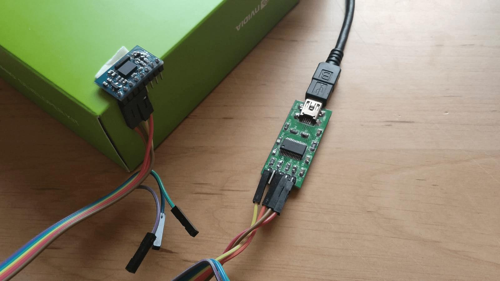
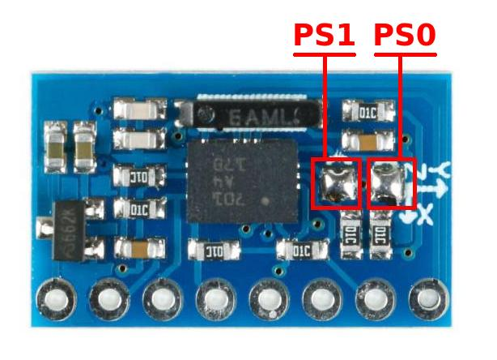
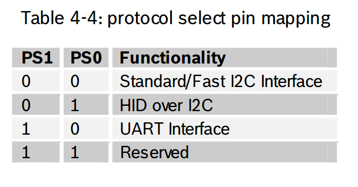
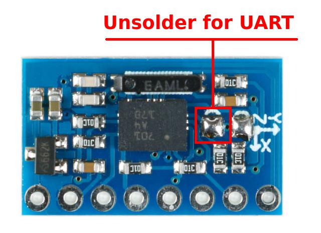
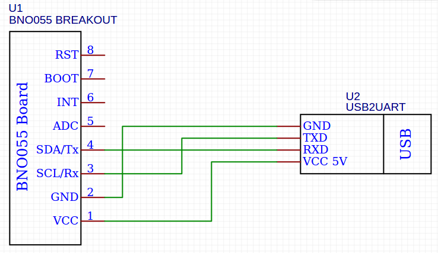
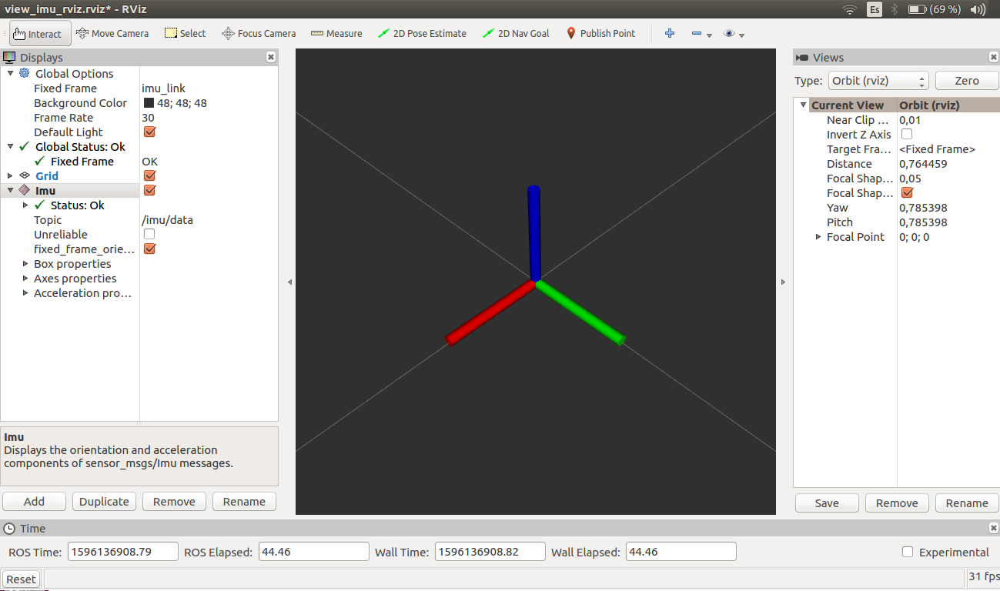
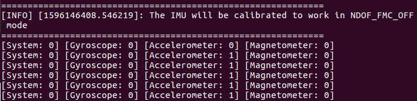
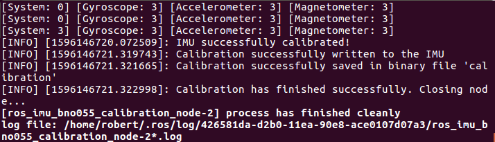
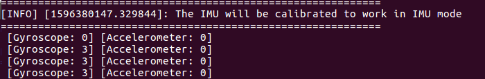

# ros_imu_bno055


**Author**: Robert Vasquez Zavaleta

*Robotic Arts, All Rights Reserved 2020*

Software License Agreement (BSD License)

**Description**: ROS driver for the BNO055 IMU using serial communication. Also it allows the configuration and calibration of the IMU

## Overview

BNO055 IMU is a Bosh sensor that  integrates an accelerometer, a gyroscope and a magnetometer in one package. Unlike other IMUs, the BNO055 is able to directly offer orientation in space. This is thanks to the different sensory fusion algorithms implemented on the chip. In this way, it is not necessary to perform additional calculations. Also, it is capable of using I2C or UART communication.

**This repository offers a ROS package** and an API written in python to **communicate with the IMU BNO055 using UART** communication through a USB Serial Converter. In addition, all the necessary functionalities have been **implemented** to correctly use the **sensor calibration**. On the other hand, thanks to the API it **is possible to set** various **configuration parameters** of the IMU.





## 1. Requisites

* Ubuntu with ROS Kinetic or Melodic
* Python 3
* Bosch IMU BNO055
* USB Serial Converter

## 2. Hardware setup

There are different boards that incorporate the BNO055 IMU. The cheapest one is from Aliexpress. This board has two solder bridges called PS0 and PS1 used to select the type of communication. 

On the other hand, on this board the solder bridges are inverted. This means that its state is 1 if the bridge is not soldered. If the bridge is soldered the state is 0. The table on the left, obtained from the BNO055 datasheet, shows the communication modes based on PS0 and PS1




**To use the IMU in this package**, it must be configured in **UART mode** to be able to communicate with the serial to USB converter. Therefore PS0 = 0 and PS1 = 1. Remember that on this board the solder bridges are inverted, so the PS1 bridge must be unsolder.



Finally, connect the IMU to the serial to USB converter. The Rx and Tx cables are crossed. The power of the BNO055 module is 5V



If you are using a different board, for example the Adafruit board or a different Chinese board, use [this link](https://gr33nonline.wordpress.com/2019/04/19/dont-get-the-wrong-bno055/)

## 3. Dependences

ros_imu_bno055 package depends on the following python/ros packages:

* pyserial
* rviz_imu_plugin

## 4. Installation

Install ros_imu_bno055 package

```
$ cd ~/catkin_ws/src
$ git clone https://github.com/RoboticArts/ros_imu_bno055.git
```

It is important to compile the package so that the libraries are added correctly

```
$ cd ~/catkin_ws
$ catkin_make --only-pkg-with-deps ros_imu_bno055
$ source devel/setup.bash
```

By default the standard ROS installation does not include any plugin to display the orientation of the IMUs in rviz. Therefore, you will need to install the **Imu plugin**. If you does not need to see the IMU in rviz you can skip this step.

Kinetic:
```
$ sudo apt-get install ros-kinetic-rviz-imu-plugin
```
Melodic:
```
$ sudo apt-get install ros-melodic-rviz-imu-plugin
```

Finally pyserial must be installed if it is not on the computer. 

```
$ pip install pyserial
```

(Optional) If you are using a Serial to USB converter with the **original FTDI chip** you can install the udev rule to identify the device as ```ttyUSB_IMU```

```
$ roscd ros_imu_bno055
$ sudo cp utils/99-bno055.rules /etc/udev/rules.
$ sudo udevadm control --reload-rules && sudo udevadm trigger
```

## 5. View IMU

1. Make sure to connect the IMU well to the computer. Check the Hardware Setup section for more information

2. In a terminal, launch the following command to display the IMU in RVIZ

```
$ roslaunch ros_imu_bno055 view_imu.launch
```

3. Move the IMU to view its orientation in RVIZ.




## 6. BNO055 ROS driver

1. Use the command below to start the driver in ROS. This launch file is the same as the previous one but neither the tf nor rviz is published

```
$ roslaunch ros_imu_bno055 imu.launch serial_port:=/dev/ttyUSB0
```

2. This driver allows to configure various parameters of the IMU. The following table describes each parameter


| Argument | Default value | Description |
| ------ | ------ | ------ |
| serial_port | /dev/ttyUSB0 | USB port where the IMU is connected (using a USB Serial Converter ) |
| frame_id | imu_link | Name of the link that the tf will use |
| operation_mode | IMU |  Type of sensory fusion used by the IMU. The next section will explain each mode in detail. |
| oscillator | INTERNAL | Use internal or external oscillator. Set EXTERNAL if you BNO055 board has a external oscillator to get more accurate clock vary for lower sensitivity error (this does not improve drift).
| reset_orientation | true | Resets the IMU to resets the orientation of the axis that is located perpendicular to the ground plane. This is important since the movements are relative to the first position the IMU had when it was turned on or reset. Set it to True to reset the position every time the driver is launched|
| frequency | 50 | Frequency of reading the IMU and publication in ROS. The maximum frequency reached by the IMU is 50 Hz |
| use_magnetometer | false | Enables topic imu/magnetometer |
| use_temperature | false | Enables topic imu/temperature |


3. The IMU BNO055 implements a sensory fusion algorithm based on the accelerometer, gyroscope and magnetometer to obtain orientation. These sensory fusion modes are:

| Operation mode | Description |
| ------ | ------ |
| IMU | The relative orientation of the BNO055 in space is calculated from the accelerometer and gyroscope data. |
| COMPASS | This mode is intended to measure the magnetic earth field and calculate the geographic direction. The heading  can only be calculated when considering gravity and magnetic field at the same time  |
| M4G | Similar to the IMU mode, but instead of using the gyroscope signal to detect rotation, the changing orientation of the magnetometer in the magnetic field is used. |
| NDOF_FMC_OFF | This fusion mode is same as NDOF mode, but with the Fast Magnetometer Calibration turned ‘OFF’.  |
| NDOF | The absolute orientation data is calculated from accelerometer, gyroscope and the magnetometer.  In this mode the Fast Magnetometer calibration is  turned  ON  and  thereby  resulting  in  quick  calibration  of  the  magnetometer |


4. When selecting an operating mode, the sensors involved and the resulting type of orientation must be taken into account. The table below shows the possible combinations.

**Note: Sensors not used in one mode of operation will turn off.** For example, if the IMU mode is selected, the magnetometer will not work and therefore its value cannot be published in ROS. Also keep in mind that its orientation will be relative.

| Operation mode | Accelerometer | Gyroscope | Magnetometer | Orientation |
| ------ | :------: | :------: | :------: | :------: |
| IMU | X | X |  | Relative |
| COMPASS | X |  | X | Absolute |
| M4G | X |  | X | Relative |
| NDOF_FMC_OFF | X | X | X | Absolute |
| NDOF | X | X | X | Absolute |


**5. Reset device service**

When IMU is reset it is possible to reset the orientation of the IMU while the driver is running. **Only the orientation of the axis that is perpendicular to the ground plane will be reset**. To do this, call the service below. After calling the service the IMU will be reset and therefore the initial orientation will be the orientation that it has at that moment.

```
$ rosservice call /imu/reset_device "{}"
```

**6. Calibration status service**

Returns the current state of the calibration. This service should not be called constantly since it stops the publication of the IMU:

```
$ rosservice call /imu/calibration_status "{}"
```

**7. Calibration load**

Every time the driver is launched automatically it will look for the calibration file called ```calibration```. If found, it will load the calibration into the IMU. If not found it will not load it and the IMU will use the internal factory calibration. This file is in the following path:

```
$ roscd ros_imu_bno055/src
```

The file ```calibration``` is a binary file generated by the ```imu_calibration``` node. See the next section to find out how to use that node.

**Every time the IMU is turned on or reset, the calibration must be loaded since the IMU does not have an EEPROM or flash memory.** This driver takes care of it.

8. If you are going to implement it in a launch file:

```
    <include file="$(find imu_ros_bno055)/launch/imu.launch">

        <arg name = "serial_port" value="/dev/ttyUSB0" />
        <arg name = "frame_id" value="imu_link" />
        <arg name = "operation_mode" value="IMU"/>
        <arg name = "oscillator" value="INTERNAL" />
        <arg name = "reset_orientation" value="true" />
        <arg name = "frequency" value="50" /> 
        <arg name = "use_magnetometer" value="false" />
        <arg name = "use_temperature" value="false" /> 

    <launch>
```

9. If you are going to throw it in the terminal:

```
roslaunch ros_imu_bno055 imu.launch serial_port:=/dev/ttyUSB0 operation_mode:=IMU
```

## 7. IMU calibration

BNO055 IMU has an internal factory calibration, however, it is highly recommended to calibrate it. The node ```imu_calibration``` generates a calibration file for the accelerometer, gyroscope, and magnetometer. The generated file will be used by the bno055 ros driver to load it into the IMU. Remember that BNO055 does not have an EEPROM or flash memory to store the calibration so every time the IMU is turned on or reset, the calibration has to be loaded.

**The type of calibration obtained** will **depend on the operating mode** of the IMU (see table in section 6.3). This means that if the IMU will work in NDOF_FMC_OFF mode then the calibration has to be done in that same mode.


To launch the calibration, in this case operation mode will be ```NDOF_FMC_OFF```:

```
roslaunch ros_imu_bno055 imu_calibration.launch serial_port:=/dev/ttyUSB0 operation_mode:=NDOF_FMC_OFF
```

The status of the three sensors will immediately appear on the terminal. Value 0 means there is no calibration, value 3 means full calibration. The parameter ```system```  indicates the current status of the three sensors. A value of 0 indicates that there is no calibration. A value of 3 indicates that the IMU has completed the calibration



* **To calibrate the magnetometer:** Make  some random movements  (for  example:  writing  the  number  ‘8’  on air) until  the magnetometer indicates fully calibrated

* **To calibrate the gyroscope:** Place the device in a single stable position for a period of few seconds to allow the gyroscopeto calibrate

* **To calibrate the accelerometer:** Place the device in 6 different stable positions for a period of few seconds to allow the accelerometer to calibrate. **Make sure that there is slow movement between 2 stable positions**. Make sure that the device is lying at least once perpendicular to the x, y and z axis.

When the IMU is fully calibrated the node will finish and the calibration file will be automatically generated in ``` ros_imu_bno055/src ``` which will be used by bno055 ros driver to load calibration data into the IMU. 

The name of the calibration file will be ```OPERATION_MODE_calibration``` In this example it will be called ```NDOF_FMC_OFF_calibration```



Finally, when calibrating an operation mode, the involved sensors must be taken into account (see table in section 6.4). This means that when calibrating in IMU mode, it will only be done for the accelerometer and gyroscope



For more information about how calibrate BNO055:

[](http://www.youtube.com/watch?v=Bw0WuAyGsnY "cal")